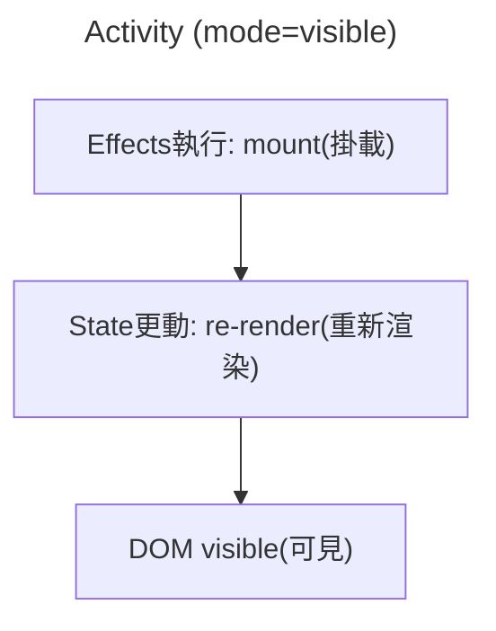
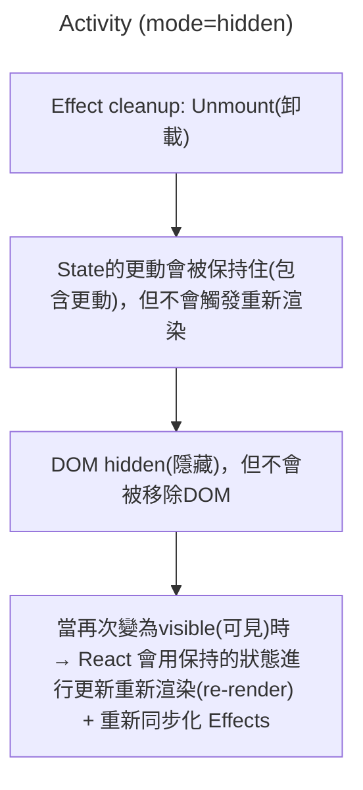

## 流程圖

```mermaid
---
title: Activity (mode=visible)
---
flowchart TD
    id1["Effects執行: mount(掛載)"]
    id2["State更動: re-render(重新渲染)"]
    id3["DOM visible(可見)"]
    id1 --> id2 --> id3
```

---

```mermaid
---
title: Activity (mode=hidden)
---
flowchart TD
    id1["Effect cleanup: Unmount(卸載)"]
    id2["State的更動會被保持住(包含更動)，但不會觸發重新渲染"]
    id3["DOM hidden(隱藏)，但不會被移除DOM"]
    id4["當再次變為visible(可見)時 → React 會用保持的狀態進行更新重新渲染(re-render) + 重新同步化 Effects"]
    id1 --> id2 --> id3 --> id4
```

