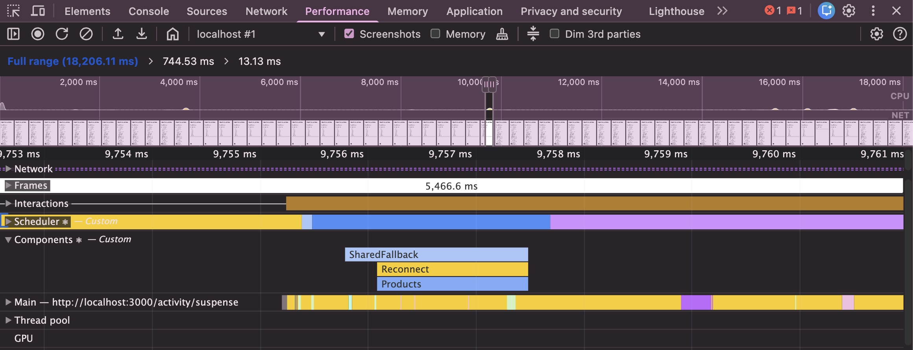
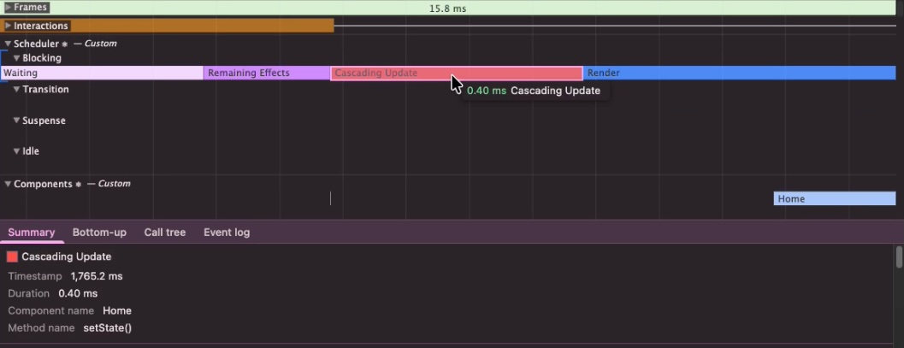
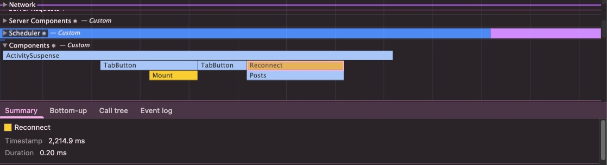
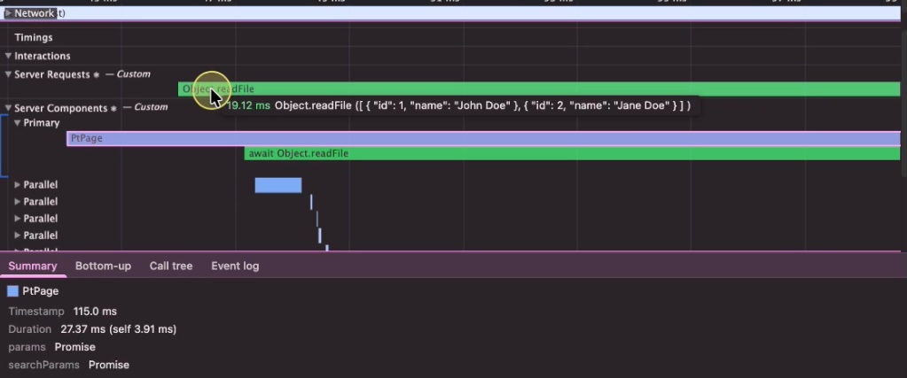

<!-- _header: '' -->
<!-- _footer: '' -->

# Performance Tracks (效能軌跡)

## Eddy 艾迪

✉️ hello@eddychang.me

---

# 什麼是 Performance Tracks 效能軌跡 (What)

- [Performance Tracks(效能軌跡)](https://react.dev/reference/dev-tools/react-performance-tracks): 顯示在瀏覽器開發者工具的「效能面板」，在時間軸上的「特定的自訂條目」 (註: 並不是在 React Devtools)

---

# 軌跡條目(特定的自訂條目)

📌**Scheduler(排程器)** React 內部用於管理不同"優先權工作"的概念。用於管理不同優先順序的任務
📌**Components(元件)** React 元件的運行時間。每個條目代表相應元件及其下所有子元件的渲染時間
📌**Server(伺服器)** 所有最終進入 React 伺服器元件(RSC) 的 Promise。這會包含任何 async(異步) 操作，例如呼叫 fetch 或異步的 Node.js 檔案操作

---

# Scheduler(排程) - 4 個子軌跡（Subtracks）

> React 內部用於管理不同優先權任務的概念。此軌跡由 4 個子軌跡（Subtracks） 組成，每個子軌跡分別代表特定優先權的工作

📌**Blocking(阻塞)** 同步更新，通常是由使用者互動所觸發。最高優先權的任務，例如輸入框的文字輸入
📌**Transition(過渡)** 在背景執行的非阻塞工作，通常是透過 startTransition 初始執行
📌**Suspense(懸停)** 與 Suspense 邊界相關的工作，例如顯示備用內容(fallbacks)或呈現最終內容
📌**Idle(閒置)** 最低優先權的工作，只會在沒有其他高優先權任務時才會執行。例如非必要的幕後清理工作

---

# Renders(渲染)

> 每一次渲染流程都由多個階段組成，在時間軸上可以觀察到這些階段

📌**Update(更新)** 觸發新渲染流程的理由
📌**Render(渲染)** React 透過呼叫元件的渲染函式來渲染更新後的子樹。可以在「Components元件）」軌跡中看到渲染的元件子樹
📌**Commit(提交)** 完成元件渲染後，React 會將變更提交至 DOM，並執行佈局副作用，例如 useLayoutEffect
📌**Remaining Effects(剩餘副作用** React 執行已渲染子樹的被動副作用，這時間點是執行例如useEffect。已知的例外是使用者互動(如點擊)或其他離散事件如 click, keydown, focus 等非連續性事件，在這種情況下，此階段可能會在繪製之前執行

---

# Cascading updates 連鎖/串接/级联 更新

> 連鎖更新是導致效能退化的一種模式。如果在一輪渲染流程中又排程了新的更新，React 可能會捨棄已完成的工作並重新開始。 (註: 通常是效能瓶頸問題所在位置)

> 在開發建置版本中，React 可以顯示是哪個元件排程了新的更新，這包括一般更新以及連鎖接更新。你可以可以透過點擊「Cascading update」項目來查看增強版堆疊追蹤 (enhanced stack trace)，這通常也會顯示觸發更新的方法 (method) 名稱。

---

# Cascading updates 連鎖/串接/级联 更新(示意圖)

---

# Components 元件

> 元件軌跡將 React 元件的執行耗時視覺化。這些資訊以「火焰圖(flamegraph)」的形式呈現，其中每個項目都代表該元件，及所有子代元件渲染所花費的時間 (註: 類似於原本的Profile面板)

在渲染與作用(Effects)階段，可能會顯示額外的事件：

📌**Mount(掛載)** 元件渲染或副作用所對應的子樹已掛載
📌**Unmount(卸載)** 元件渲染或副作用所對應的子樹已卸載
📌**Reconnect(重新連接)** 與 Mount 類似，但限於使用 <Activity> 元件的情況
📌**Disconnect(斷開連接)** 與 Unmount 類似，但限於使用 <Activity> 元件的情況

---

# Components 元件(示意圖)

---

# Server 伺服器

📌**Server Requests(伺服器請求)軌跡** 將所有最終進入 React 伺服器元件(RSC)的 Promise 視覺化。包含任何異步操作，例如呼叫 fetch 或異步的 Node.js 檔案操作

📌**Server Components(伺服器元件)軌跡** 將 React 伺服器元件(RSC)及其所等待(await)的 Promise 執行耗時視覺化。時間軸資訊以火焰圖的形式呈現，其中每個項目都代表該元件及其所有子代元件渲染所花費的時間

---

# Server 伺服器

---

# 如何使用 Performance Tracks 效能軌跡 (How)

1. 確保使用的是 React v19.2+ (或 Next.js v16+)，而且是「開發建置版本」（註: 用 `npm run dev` 啟動）
2. 打開 Chrome 開發者工具，切換到 Performance(效能)面板
3. 點擊面板左上的 Record() 或 Record and Reload ()，操作應用程式並錄製
4. 停止錄製後，在時間軸下方的軌道中，尋找名稱後帶有 React 標誌「⚛️」特定軌跡
5. 使用滑鼠滾輪(或觸控板雙指滑動)來進行時間軸的「放大或縮小」。點擊滑鼠左鍵並拖曳畫面「上下左右移動」（註：快速鍵 W 放大 S 縮小 A 左移 和 D 右移)

