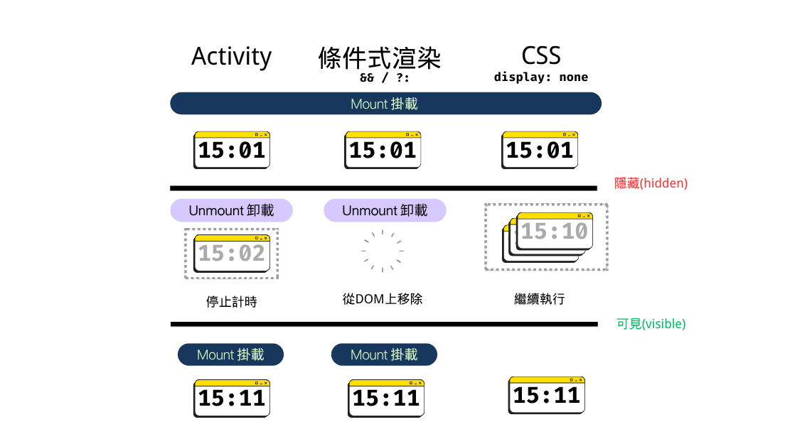

<!-- _header: '' -->
<!-- _footer: '' -->


# useEffectEvent勾子

## Eddy 艾迪

✉️ hello@eddychang.me

---

# 什麼是 useEffectEvent (What)

- [`useEffectEvent`](https://react.dev/reference/react/useEffectEvent): 一個React勾子，可以讓你從Effects中提取非響應式邏輯(non-reactive logic)，到一個稱為Effect Event的可重覆使用的函式中

> 註: 它並非一個全新的東西，最初在官方Github中 [issue#14099](https://github.com/facebook/react/issues/14099) 有針對這種實作上的問題討論(2018)，社群中也有實現類似作用的客製化勾子(例如useEventCallback)，最初RFC訂名為[useEvent](https://github.com/reactjs/rfcs/pull/220)，在v18時的Canary發佈頻道已加入實驗性的實作(2022)

---

```ts
// @enableActivity
export interface ActivityProps {
    /**
      * @default "visible"
      */
    mode?:
        | "hidden"
        | "visible"
        | undefined;
    /**
      * A name for this Activity boundary for instrumentation purposes.
      * The name will help identify this boundary in React DevTools.
      */
    name?: string | undefined;
    children: ReactNode;
}
```

---

# 為什麼要使用 Activity (Why)

1. 主要對於"條件渲染"樣式，在某些場景下的實作改進
   1. 需要在"呈現/隱藏"間的反覆切換的UI，例如: 資訊標籤(Tabs)等
   2. 除了React元件狀態外也有DOM狀態，需要保留的情況(例如: 捲軸位置、表單輸入或`<video>`,`<audio>`,`<iframe>`等)
2. 提供類似"休眠(Sleep)"或"暫停(Pause)"意義的狀態，可讓元件在隱藏時保留狀態，在呈現時立即還原，而不需要重新掛載元件<sup>註1</sup>
3. 另外，在客戶端和伺服器間的交互應用，可以預先載入資料與渲染，提升使用者體驗減少資料載入時間

> 註1: 在概念上"隱藏(hidden)"仍然是"卸載(unmounted)"。目前在新效能剖析功能有出現"重連(Reconnect)"與"斷連(Disconnect)"的針對Activity元件的額外事件標記

---




---


# vs 條件式渲染

| 特性 | 條件渲染 (`&&` 或 `?:`) | `<Activity>` |
|------|------------------------|--------------|
| **狀態保留** | ❌ 隱藏=卸載，狀態遺失 | ✅ 隱藏時狀態保留 |
| **DOM** | ❌ 隱藏=卸載，從DOM中移除 | ✅ 隱藏時仍存在於 DOM |
| **元件實例** | ❌ 每次顯示都會重新建立 | ✅ 保持相同的元件實例 |
| **重新渲染** | ❌ 需要完整重新掛載 | ✅ 還原狀態後再重新掛載 |
| **記憶體** | ✅ 隱藏=卸載，不佔用記憶體 | ⚠️ 隱藏時仍佔用記憶體 |

---

# 條件式渲染

## 合適場景

1. ✅不是頻繁切換的呈現/隱藏的UI
2. ✅在不同頁面或內容差異較大的區塊的元件
3. ✅與權限有關的元件渲染

## 不合適場景

1. ❌頻繁切換的呈現/隱藏的UI
2. ❌有各種進出入動畫或轉場效果的UI

---

# vs CSS 樣式隱藏/呈現

| 特性 | CSS `display: none` | `<Activity>` |
|------|---------------------|--------------|
| **狀態保留** | ✅ 隱藏時狀態保留 | ✅ 隱藏時狀態保留 |
| **DOM** | ✅ 隱藏時仍存在於 DOM | ✅ 隱藏時仍存在於 DOM |
| **元件實例** | ✅ 保持相同的元件實例 | ✅ 保持相同的元件實例 |
| **Effects** | ❌ 隱藏時持續執行不清理 | ✅ 隱藏時清理，可見時恢復同步 |
| **重新渲染** | ⚠️ 持續響應props更新 | ✅ 持續響應props更新(但優先級低於可見內容)  |
| **記憶體** | ⚠️ 隱藏時仍佔用記憶體 | ⚠️ 隱藏時仍佔用記憶體 |

---

# CSS 樣式隱藏/呈現

## 合適場景

1. ✅頻繁切換的呈現/隱藏的UI，內容簡單或靜態的，而且與Effects(副作用)無關
2. ✅有各種進出入動畫或轉場效果的UI
3. ✅需要持續運行的背景程序(例如: 計時器、監聽事件、WebSocket等等)

## 不合適場景

1. ⚠️隱藏的內容是需要長時間載入UI<sup>註1</sup>
2. ❌需要管理Effects(副作用)的執行、清理時間點，與狀態保留

> 註1: 例如: 大量資料、影音檔案下載、計算等等，隱藏的子女元件與整個頁面同時渲染可能會造成效能問題

---

# 什麼時候和場景使用 Activity (When/Where)

1. 切換分頁/資訊標籤 (Tabs)
2. 折疊UI (Collapse/ OffCanvas/ Drawer/ Sidebar)
3. 需要還原與保留(休眠/暫停)的混合式的狀態<sup>註1</sup>
4. 需要預先載入資料或渲染UI，通常是先隱藏(例如: 搜尋結果、資料預先載入)

> 註1: 狀態是混合了React中的狀態和瀏覽器的DOM狀態，例如: 捲軸位置、表單輸入或`<video>`,`<audio>`,`<iframe>`等，會需要保留狀態以避免重新渲染時遺失狀態

---

# 如何使用 Activity (How)

```jsx
const [activeTab, setActiveTab] = useState('home');

<Activity mode={activeTab === 'home' ? "visible" : "hidden"}>
  <Home />
</Activity>
<Activity mode={activeTab === 'video' ? "visible" : "hidden"}>
  <Video />
</Activity>
```

---

# 結論

1. 可當作是在某些應用場景下，"條件渲染"或"CSS樣式隱藏/呈現"的另一種替代的實作方案，具有在真實DOM中保留狀態和能控制Effects(副作用)的特性，主要用於提升效能與改善使用者體驗(例如: 資訊標籤(Tabs)、折疊UI (Collapse/ OffCanvas/ Drawer/ Sidebar))
2. 可以搭配Suspense元件使用，來實現資料預先載入與顯示
3. 可以搭配使用於動畫樣式的ViewTransition元件(19.2尚未加入)

---

# 應用場景範例1 - 資訊標籤(Tabs)基本使用

---

# 應用場景範例3 - 資訊標籤(Tabs)+資料預先載入

---

# 應用場景範例2 - 側邊欄(Sidebar)+混合式的狀態

